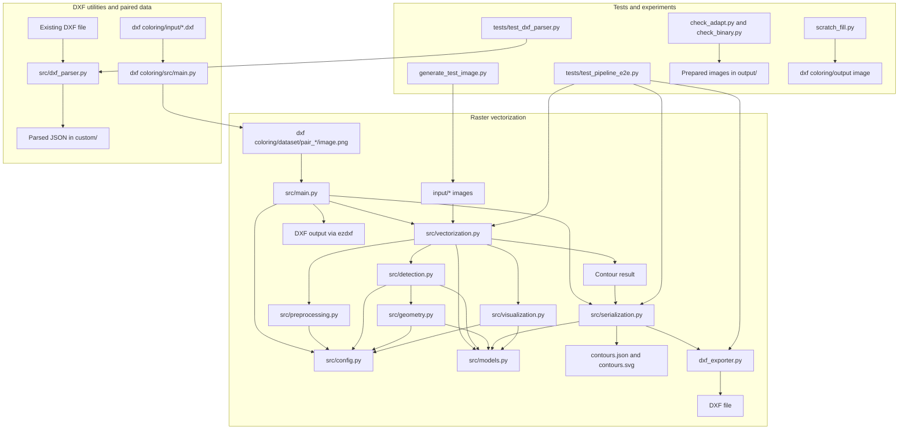

# Project Documentation

## Overview

This repository contains an image-to-contour vectorization pipeline, supporting DXF conversion utilities, tests, and a large collection of DXF/image data. The main pipeline turns raster drawings into contour geometry and can export that geometry as JSON, SVG, and DXF.

The file inventory below covers maintained project files and describes large collections by their repeated structure. It excludes `.git/`, `.venv/`, Python bytecode caches, and other local tooling state.

## Root Files

| File | Purpose |
| --- | --- |
| `README.md` | Project introduction, features, setup, and usage examples. Its single-image CLI example does not currently match `src/main.py`, which accepts a dataset directory. |
| `documentation.md` | This file: project inventory, module responsibilities, data flow, and architecture diagram. |
| `requirements.txt` | Python dependencies for image processing, tests, DXF handling, rendering, and the planned graph-learning work. |
| `.gitignore` | Excludes Python caches, environments, test reports, generated root output, and selected input/dataset directories. |
| `plan.md` | Describes the intended raster contour-vectorization pipeline and its original implementation scope. |
| `Transformer.md` | Design notes for a future graph-transformer DXF correction system; it is a plan, not an implemented model. |
| `generate_test_image.py` | Creates a synthetic black circle with a white inner hole and writes it to `input/sample.png`. |
| `check_adapt.py` | Reads a prepared adaptive-threshold image from `output/`, extracts contours, and prints their areas and perimeters. |
| `check_binary.py` | Reads prepared threshold-result images from `output/` and prints their unique pixel values and mean intensity. |
| `scratch_fill.py` | Experimental image-filling script for a hard-coded image under `dxf coloring/output/`; this folder/image is not part of the checked-in `dxf coloring` layout. |

## Main Python Package: `src/`

| File | Purpose |
| --- | --- |
| `src/__init__.py` | Re-exports the public configuration, geometry/result models, pipeline, and JSON serialization API. |
| `src/config.py` | Defines threshold, filter, polarity, and coordinate-space enums plus `VectorizationConfig`, the settings object used throughout the pipeline. |
| `src/models.py` | Defines the data structures for points, bounds, contours, image metadata, processing metrics, and complete results. |
| `src/main.py` | Dataset-oriented command-line runner. Finds `pair_*` directories, processes each `image.png`, then writes DXF, JSON, SVG, and optional debug views. |
| `src/preprocessing.py` | Loads image paths/bytes/arrays, handles grayscale and alpha, and provides grayscale enhancement, filtering, thresholding, morphology, polarity detection, and direct-color edge extraction. |
| `src/detection.py` | Finds contours with OpenCV, builds parent/child hierarchy, filters invalid contours, simplifies geometry, normalizes winding, converts coordinates, and creates contour models. |
| `src/geometry.py` | Implements contour simplification, duplicate/collinear-point removal, winding-order normalization, and coordinate-space transforms. |
| `src/vectorization.py` | Orchestrates image loading, preprocessing, contour processing, metrics, result construction, and optional debug visualization through `VectorizationPipeline`. |
| `src/serialization.py` | Converts vectorization results to/from JSON and writes SVG; the JSON/SVG helpers can return serialized text or save it to a path. |
| `src/visualization.py` | Writes preprocessing panels, color-coded contour views, and overlays into an output directory. |
| `src/dxf_exporter.py` | Standalone JSON-to-DXF converter. Makes hierarchy layers, maps coordinates, and stores contour metadata in DXF extended data. |
| `src/dxf_parser.py` | Standalone DXF-to-JSON parser for headers, layers, modelspace entities, blocks, geometry, attributes, and extended data. |

## Tests: `tests/`

| File | Purpose |
| --- | --- |
| `tests/test_pipeline_e2e.py` | Exercises image loading, geometry cleanup, contour hierarchy, preprocessing modes, SVG export, and JSON-to-DXF export. |
| `tests/test_dxf_parser.py` | Builds a small DXF fixture, parses it, and checks extracted layers, entities, geometry, and XDATA. |

## DXF Rendering Utility: `dxf coloring/`

| File or directory | Purpose |
| --- | --- |
| `dxf coloring/.gitignore` | Excludes the nested input and dataset collections from version control. |
| `dxf coloring/src/main.py` | Batch DXF-to-image utility. Renders DXFs, fills enclosed image regions with reproducible colors, and writes a numbered pair folder containing `image.png` and a copied `perfect.dxf`. |
| `dxf coloring/input/` | Bulk source CAD collection; the current workspace inventory contains 2,989 files, primarily DXFs. These are input data rather than Python modules. |
| `dxf coloring/dataset/` | Generated paired data collection; the current workspace inventory contains 1,494 `pair_*` directories. A typical pair includes `image.png`, `perfect.dxf`, and, after contour processing, `not perfict.dxf`, `contours.json`, `contours.svg`, and three debug PNGs. Pair contents can vary. |

The rendering script numbers pair folders based on the sorted source files it processes. The vectorization CLI can then process those folders using their `image.png` files.

## Input and Output Data

| Path | Purpose |
| --- | --- |
| `input/` | Root-level sample/test raster images used for manual experiments and examples. The current inventory contains 11 images, including PNG and JPEG files. `generate_test_image.py` writes `sample.png` here. |
| `output/contours.json` | Example serialized vectorization result. |
| `output/contours.svg` | SVG representation of example contours. |
| `output/debug_contours.png` | Debug drawing of extracted contour paths and vertices. |
| `output/debug_overlay.png` | Debug overlay of contours on the source image. |
| `output/debug_preprocessed.png` | Debug panel showing original, grayscale, filtered, and binary images. |
| `output/drawing.dxf` | Example CAD drawing output. |
| `output/EAGLE.dxf` | Additional DXF data/output file. |

The root `output/` files are sample artifacts; the dataset CLI writes its generated results inside each processed pair directory instead.

## Data Flow and Usage Notes

The main API is `VectorizationPipeline.process_image(image_source, output_dir=None)`. The input can be an image path, encoded bytes, or a NumPy image array. Configuration is supplied through `VectorizationConfig`.

The CLI in `src/main.py` currently accepts `--dataset` (default `dxf coloring/dataset`), `--threshold-method`, `--epsilon-factor`, `--coord-space`, `--min-area`, and `--no-debug`. It does not currently accept the `--input` option shown in the README. For each pair it expects `image.png`; when a result has fewer than 100 contours, the script removes that pair directory. Review that behavior before running it on data you need to preserve.

`src/dxf_exporter.py` is a separate JSON-to-DXF path, while `src/dxf_parser.py` reads DXF files and writes parsed JSON to a `custom/` directory relative to the current working directory. They are not invoked by the image-processing pipeline's `main()` function.

## Architecture Diagram

